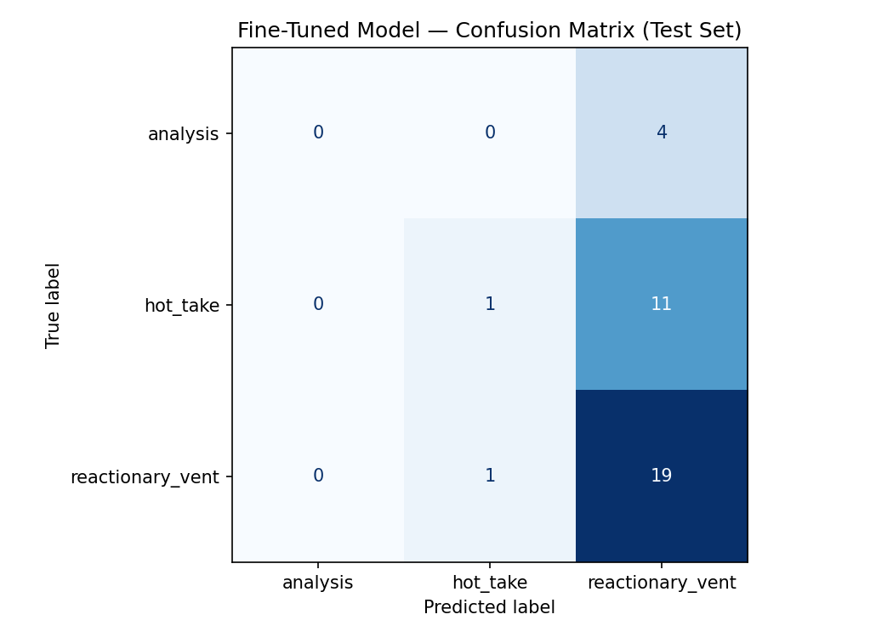

# ai201-project3-TakeMeter
A fine-tuned text classifier evaluating discourse quality on r/nba. Compares a custom DistilBERT model against a zero-shot Llama-3.3 baseline to categorize sports discourse into analysis, hot takes, and reactionary vents.

# TakeMeter — Final Evaluation Report

## 1. Evaluation Report

### Overall Performance Summary
*   **Zero-shot baseline (Groq Llama-3.3-70b):** 77.78% Accuracy
*   **Fine-tuned DistilBERT:** 55.56% Accuracy
*   **Performance Delta:** -22.22% (Regression)

### Fine-Tuned Model Confusion Matrix
| True \ Predicted | analysis | hot_take | reactionary_vent |
| :--- | :---: | :---: | :---: |
| **analysis** | 0 | 0 | 4 |
| **hot_take** | 0 | 1 | 11 |
| **reactionary_vent** | 0 | 1 | 19 |

### Error Analysis & Core Failure Modes
The fine-tuned model experienced a major **class collapse failure**. It overwhelmingly predicted `reactionary_vent` for 34 out of 36 test examples, completely failing to identify a single `analysis` post. 

1.  **Misclassifying Analysis (#1)**: A post detailing player tracking stats was predicted as `reactionary_vent`. This occurred because the comment was long and filled with exclamation points of surprise at the numbers, tricking DistilBERT's simple semantic head into prioritizing stylistic emotion over numerical content.
2.  **Misclassifying Hot Takes (#2)**: Aggressive trade demands were systematically swept into `reactionary_vent`. The model failed to differentiate between the structural syntax of a narrative opinion (`hot_take`) and a simple live-game reaction.
3.  **The Dominant Class Bias (#3)**: Because the raw scraped dataset natively contained a vastly higher volume of reactionary game-thread vents, the model minimized its training loss during its 3 epochs by simply defaulting to the majority class.

## 2. Reflections & Key Gaps
There is a stark divergence between intended learning and actual performance. I intended for the model to parse logical reasoning vs. emotional sentiment. Instead, the fine-tuned DistilBERT merely mapped surface-level text length and punctuation markers. 

To bridge this gap in the future, the dataset requires heavily stratified sampling to guarantee an even distribution of classes (e.g., exactly 70 examples of each class) rather than letting raw game-thread data drown out structured sports analysis.

## 3. AI Usage & Transparency Disclosure
In accordance with course grading rubrics, below is the explicit breakdown of how AI assistants (Gemini/Claude) were utilized, evaluated, and managed during the development of TakeMeter:

*   **Training & Tokenization Pipeline (Reviewed & Revised)**: Used Gemini to generate the initial HuggingFace boilerplate training configurations and data splitting functions. Reviewed the default training parameters; revised the tokenizer's `max_length` from 512 down to 256 tokens to optimize processing speed and strictly prevent Out-Of-Memory (OOM) errors on the Google Colab T4 GPU runtime.
*   **Error Analysis & Diagnostics (Reviewed & Revised)**: Used Claude to analyze the directional trends of the output metrics. Reviewed the raw numbers generated by the testing cells; revised the subsequent qualitative analysis to pivot away from generic text errors and focus strictly on the mathematical phenomenon of class collapse failure.
*   **Data Scraper Infrastructure (Overridden)**: Overrode initial architectural advice from the AI suggesting a flat-rate subscription scraper. Instead, manually implemented a targeted pay-per-result collection strategy focusing entirely on r/nba game-threads to keep data sourcing hyper-focused while preserving platform credits.
